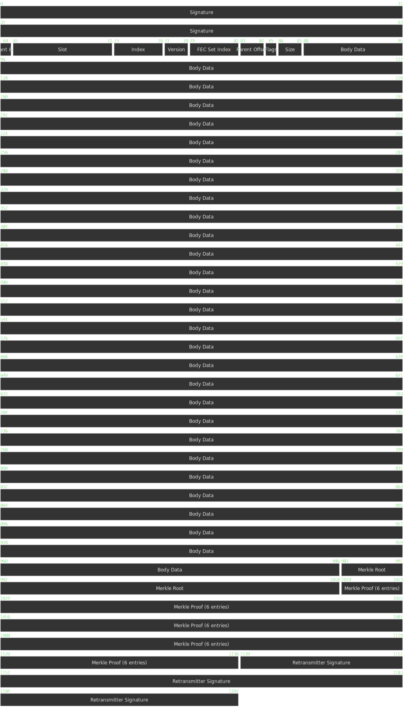

# Solana Shred Format

## Overview
Solana uses **shreds** as fundamental data units in block propagation.

Solana uses two distinct types of shreds:
1. **Data Shreds** – Contain actual ledger data (transactions).
2. **Coding Shreds** – Used for **Forward Error Correction (FEC)**, allowing shreds to be reconstructed in case of packet loss and/or deliberate censoring by validators.

### Notes:
 a) Coding shreds encode entire data shreds: both of the headers AND the payload.
 b) Coding shreds require their own headers for identification and etc.
 c) The erasure algorithm requires data shred and coding shred bytestreams to be equal in gth.

 So, when choosing maximum shred size, we must restrict data shred's payload length such that the entire data shred can fit into one coding shred / packet.

---

## **Shred Structure**

Each shred consists of three main components:
- **Header** – Metadata describing the shred, such as type, slot, index, and cryptographic signature.
- **Body** – The main data section, which stores either ledger data (for Data Shreds) or error correction information (for Coding Shreds).
- **Trailer** – Additional fields, such as **Merkle proofs**, **chained signatures**, and **retransmitter signatures**, which help verify shred authenticity and integrity. Shreds may also contain a **repair nonce** which indicates that a shred has been sent in response to a repair request.

### **1. Header Structure**
Each shred contains a **header** that includes essential metadata:

| **Shred Type**  | **Common Header** | **Specific Header** | **Body** | **Trailer** |
|----------------|------------------|-------------------|----------|-----------|
| Data Shred | 83 bytes | 5 bytes | Variable | Variable |
| Coding Shred | 83 bytes | 6 bytes | Variable | Variable |

Thus, the total **header size** for each shred type is:
- **Data Shreds:** `Common Header (83) + Data Shred Header (5) = 88 bytes`
- **Coding Shreds:** `Common Header (83) + Coding Shred Header (6) = 89 bytes`

---

## **3. Common Header (83 bytes, Little Endian)**
The **Shred Common Header** is present in all shreds.

| Field Name        | Size (bytes) | Type      | Description |
|------------------|----------|----------|-------------|
| **Signature**    | 64       | `bytes`  | Ed25519 signature verifying the shred’s authenticity. |
| **Shred Variant** |4 bits          | `uint4`  | Identifies the type of shred. |
| **Proof Size**   | 4 bits   | `uint4`  | Number of Merkle proof entries. |
| **Slot**         | 8        | `uint64` | The slot to which this shred belongs. |
| **Index**        | 4        | `uint32` | Unique identifier of the shred within its slot. |
| **Version**      | 2        | `uint16` | Identifies the cluster, `shred_version = hash(genesis_block) % 65536;` |
| **FEC Set Index** | 4       | `uint32` | Index of the first shred in this Forward Error Correction (FEC) set. |

Solana uses multiple types of shreds identified by the ShredVariant bits as follows:
   - **Code** (`0x40`): Coding shred with Merkle verification.
   - **Code (Chained)** (`0x60`): Linked coding shreds.
   - **Code (Chained Resigned)** (`0x70`): Chained with retransmitter signature.
   - **Data** (`0x80`): Holds transaction data with Merkle verification.
   - **Data (Chained)** (`0x90`): Linked Merkle data shreds.
   - **Data (Chained Resigned)** (`0xB0`): Chained with retransmitter signature.
---

## **4. Data Shred Header (5 bytes, Little Endian)**
These header fields are **only present** in **Data Shreds**.

| Field Name | Size (bytes) | Description                                                                                                                                                                                                                                                           |
|------------|-------------|------------------------------------------------------------------------------------------------------------------------------------------------------------------------------------------------------------------------------------------------------------|
| **Parent Offset** | 2 | Distance to the parent shred (for chained shreds).                                                                                                                                                                                                                    |
| **Flags** | 1 | Metadata flags (e.g., last shred in FEC set).                                                                                                                                                                                                                         |
| **Size** | 2 | The size field represents the total length of the shred's meaningful content, including the common headers and payload data. It does not account for any padding or trailer content |

---

## **5. Coding Shred Header (6 bytes, Little Endian)**
These header fields are **only present** in **Coding Shreds**.

| Field Name | Size (bytes) | Description |
|------------|-------------|-------------|
| **Num Data Shreds** | 2 | Number of data shreds in the FEC set. |
| **Num Coding Shreds** | 2 | Number of coding shreds in the FEC set. |
| **Position** | 2 | Position of this coding shred in the FEC set. |

---
### **6. Body & Trailer Data**
The body contains either **transaction data** (for **Data Shreds**) or **erasure coding** (for **Coding Shreds**).

For **Data Shreds**, the body consists of **ledger entries**, and if the available space is not fully utilized, **padding bytes (zeroes) may be appended** to maintain a fixed shred size. This padding is **not included** in the `size` field of the Data Shred Header.

For **Coding Shreds**, the body holds **Reed-Solomon encoded parity data**, ensuring recoverability in case of missing data shreds. Coding Shreds are always **fixed in size** and do not require padding.

The **trailer section** follows the body and may include:
- **Merkle Root (32 bytes)** – If the shred is part of a chained Merkle structure.
- **Merkle Proof Entries (20 bytes per entry)** – Provides cryptographic proof of inclusion in the Merkle tree.
- **Retransmitter Signature (64 bytes)** – Present if the shred is **resigned**.
- **Repair nonce (4 bytes)** – Present if the shred is **repaired**.

The presence of these extra fields depends on the **shred variant** and is determined dynamically.

### **Merkle Proof & Extra Data**
Some shreds contain **Merkle proof** fields for integrity verification.

| Field Name | Size (bytes) | Description |
|------------|-------------|-------------|
| **Merkle Root** | 32 | Root hash of the Merkle tree (if `has_chained() == True`). |
| **Merkle Proof Entries** | 20 * proof_size | Merkle proof array. |
| **Retransmitter Signature** | 64 | Signature from the retransmitter (if present). |

---

### **7. Body Size Calculation**

The **body size** is determined based on the shred type and the presence of trailer fields at the end of the packet. The final body size is affected by factors such as the shred's base structure, optional merkle proofs, and retransmitter signatures.

The general formula for calculating the **body size** is:

\[
\text{body\_size} = \text{total\_shred\_size} - \text{header\_size} - (\text{has\_chained} \times 32) - (\text{has\_retransmitter\_signature} \times 64) - (\text{proof\_size} \times 20)
\]

Where:
- **total_shred_size** – The overall size of the shred (1203 bytes (**SIZE_OF_DATA_SHRED_PKT = 1203**) for Data Shreds, 1228 bytes (**SIZE_OF_CODING_SHRED_PKT = 1228**) for Coding Shreds).
- **header_size** – The size of the shred's header (88 bytes for Data Shreds, 89 bytes for Coding Shreds).
- **has_chained** (`True` or `False`) – Whether the shred includes a **Merkle Root (32 bytes)**.
- **has_retransmitter_signature** (`True` or `False`) – Whether the shred includes a **Retransmitter Signature (64 bytes)**.
- **proof_size** – The number of **Merkle Proof Entries (20 bytes each)**.

This formula applies to both Data and Coding Shreds and directly calculates the final available space for transaction data (in Data Shreds) or erasure coding (in Coding Shreds).

#### **Examples**
1. **A Data Shred with a Merkle Root and 3 Merkle Proof Entries:**
   - `total_shred_size = 1203`
   - `header_size = 88`
   - `has_chained = True`
   - `has_retransmitter_signature = False`
   - `proof_size = 3`
   - **Final body size:** `1203 - 88 - 32 - 0 - 60 = 1051 bytes`

2. **A Coding Shred with a retransmitter signature and 2 Merkle Proof Entries:**
   - `total_shred_size = 1228`
   - `header_size = 89`
   - `has_chained = False`
   - `has_retransmitter_signature = True`
   - `proof_size = 2`
   - **Final body size:** `1228 - 89 - 0 - 64 - 40 = 1035 bytes`

---

Example of the shred packet diagram:

---
