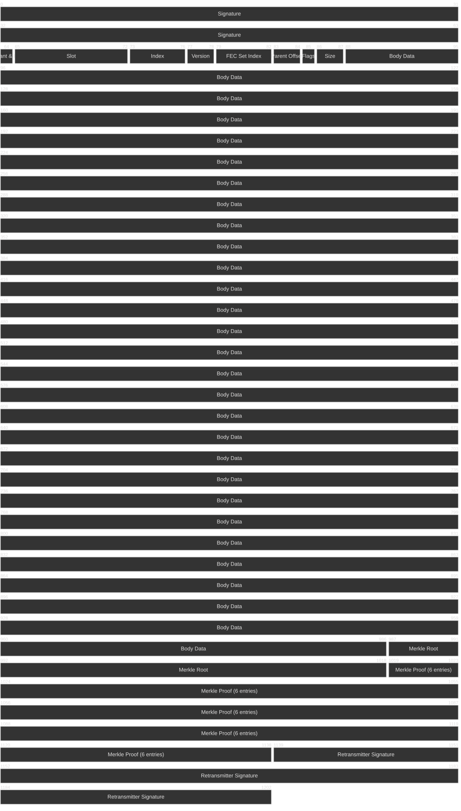

# Solana Shred Format

## Overview
Solana uses **shreds** as fundamental data units in block propagation.

There are two distinct types of shreds:
1. **Data Shreds** – Contain actual ledger data (transactions).
2. **Coding Shreds** – Used for **Forward Error Correction (FEC)**, allowing shreds to be reconstructed in case of packet loss and/or deliberate censoring by validators.

### Notes:
 a) Coding shreds encode entire data shreds: both the headers and the payload.
 b) Coding shreds require their own headers for identification and so on.
 c) The erasure algorithm requires data shred and coding shred bytestreams to be equal in length.

Based on that, when choosing maximum shred size, we must restrict data shred's payload length such that the entire data shred can fit into one coding shred / packet.

---

## Crates

The format below is implemented by five crates in this directory, layered so that a consumer takes
only what it needs:

| crate | directory | what it is |
|---|---|---|
| `solana-shred-wire-format` | `wire-format/` | the layout: section boundaries, readers and writers over bytes. |
| `solana-shred-verify` | `verify/` | the Merkle tree over an erasure batch, ed25519 signatures |
| `solana-shredder` | `shredder/` | builds and signs an erasure batches |
| `solana-fec-set-recovery` | `fec-set-recovery/` | rebuilds an erasure batch's missing shreds with Reed-Solomon. |
| `solana-shred` | `.` | the typestate shred lifecycle state machine |

---

## **Shred Structure**

Each shred comprises three main components:
- **Header** – Metadata describing the shred, such as type, slot, index, and cryptographic signature.
- **Body** – The main data section, which stores either ledger data (for Data Shreds) or error correction information (for Coding Shreds).
- **Trailer** – contains the **chained Merkle root** and the **Merkle proof**, which tie the shred to the others in its erasure batch and to the preceding batch, and, optionally, a **retransmitter signature**, which helps verify the shred's sender.

A **repair nonce** follows the shred in a repair response, tying it to the request it answers. It is
appended after the shred rather than being part of it, so neither signature covers it. Whether one is
there is not a property of the bytes at all: the socket the packet arrived on decides it, before
anything is read.

## **1. Header Structure**
Each shred contains a **header** that includes essential metadata:

| **Shred Type** | **Signature** | **Common Header** | **Specific Header** | **Body**  | **Trailer** |
|----------------|---------------|-------------------|---------------------|-----------|-------------|
| Data Shred     | 64 bytes      | 19 bytes          | 5 bytes             | 963 / 899 | 152 / 216   |
| Coding Shred   | 64 bytes      | 19 bytes          | 6 bytes             | 987 / 923 | 152 / 216   |

Body and trailer are fixed too, not variable: each pair is the unresigned and the resigned layout,
and a resigned shred gives up 64 bytes of body for the retransmitter signature its trailer reserves.
Section 7 derives all four.

Thus, the total **header size** for each shred type is:
- **Data Shreds:** `Signature (64) + Common Header (19) + Data Shred Header (5) = 88 bytes`
- **Coding Shreds:** `Signature (64) + Common Header (19) + Coding Shred Header (6) = 89 bytes`

The leader's signature is counted here because it precedes the headers and everything after it is
what the shred's own offsets are measured from, but it is not part of the common header: it is the
signature *over* the rest of the shred, and the code names the two separately as
`SIZE_OF_SIGNATURE` and `SIZE_OF_COMMON_HEADER`.

---

## **2. Signature and Common Header (64 + 19 bytes, Little Endian)**
The signature and the **Shred Common Header** are present in all shreds, in this order.

| Field Name        | Size   | Type     | Description                                       |
|-------------------|--------|----------|---------------------------------------------------|
| **Signature**     | 64     | `bytes`  | Ed25519 signature over the FEC set's Merkle root  |
| **Shred Variant** | 4 bits | `uint4`  | Kind of shred, and whether it is resigned         |
| **Proof Size**    | 4 bits | `uint4`  | Number of Merkle proof entries; always 6          |
| **Slot**          | 8      | `uint64` | Slot this shred belongs to                        |
| **Index**         | 4      | `uint32` | Index of this shred within its slot               |
| **Version**       | 2      | `uint16` | Cluster and fork identifier, see below            |
| **FEC Set Index** | 4      | `uint32` | Index of the first shred of this FEC set          |

Everything below the signature adds up to the 19 bytes of common header, which is what
`SIZE_OF_COMMON_HEADER` names; the signature is `SIZE_OF_SIGNATURE`, separate because it is the
signature over everything that follows it. The **Shred Variant** and **Proof Size** rows are the two
nibbles of a single byte, so the header is `1 + 8 + 4 + 2 + 4`.

`Version` is `compute_shred_version(genesis_hash, hard_forks)`, so it separates not only clusters
but also forks of one cluster: a shred from before a hard fork does not match a node past it.

Solana uses multiple types of shreds, identified by the high nibble of the variant byte as follows:
   - Code (`0x6_`): Reed-Solomon FEC shreds with Merkle verification.
   - Code, resigned (`0x7_`): code shreds with a retransmitter signature.
   - Data (`0x9_`): transaction data shreds with Merkle verification.
   - Data, resigned (`0xB_`): data shreds with a retransmitter signature.

The low nibble holds the proof size, so a whole byte is only fixed once that is.

Erasure batches are fixed at 32 data plus 32 code shreds, so every batch's Merkle tree has 64 leaves
and every proof is 6 entries deep. The proof size nibble is therefore always `6`, which leaves four
valid variant bytes in total: `0x66`, `0x76`, `0x96` and `0xB6`.

---

## **3. Data Shred Header (5 bytes, Little Endian)**
These header fields are **only present** in **Data Shreds**.

| Field Name        | Size | Type     | Description                                            |
|-------------------|------|----------|--------------------------------------------------------|
| **Parent Offset** | 2    | `uint16` | Slots back to this block's parent                      |
| **Flags**         | 1    | `uint8`  | Reference tick, data-complete and last-in-slot bits    |
| **Size**          | 2    | `uint16` | Length of the headers plus the ledger data (see below) |

`Size` counts the signature, both headers and the ledger data, and nothing else: not the zero
padding that follows the data, and not the trailer. So a data shred's body holds `Size - 88` bytes
of ledger data, and the remainder of the body is padding, which the erasure coding needs in order
to give every shard of a batch the same length. It is the one header field the layout does not
pin, so a reader has to validate it rather than trust it.

The two completion bits say what the shred ends, and neither is implied by the layout. A full FEC set
is 32 data shreds' worth of bytes and entries usually run past it, so the last data shred of a batch
carries `DATA_COMPLETE_SHRED` only when whoever built it says the data stops there, and
`LAST_SHRED_IN_SLOT` (which implies it on the wire) only when the slot ends there.

---

## **4. Coding Shred Header (6 bytes, Little Endian)**
These header fields are **only present** in **Coding Shreds**.

| Field Name            | Size | Type     | Description                               |
|-----------------------|------|----------|-------------------------------------------|
| **Num Data Shreds**   | 2    | `uint16` | Data shreds in this FEC set; always 32    |
| **Num Coding Shreds** | 2    | `uint16` | Coding shreds in this FEC set; always 32  |
| **Position**          | 2    | `uint16` | This shred's position among them, 0 to 31 |

`Position` places the shred's leaf in its FEC set's Merkle tree, at `Num Data Shreds + Position`, so
a value that does not agree with the shred's own index would prove a leaf of a batch the shred does
not belong to. Under the fixed configuration both index counters advance by 32 per batch from equal
starting points, so admission requires `Position < 32` and `Index - FEC Set Index == Position`.

---
## **5. Body & Trailer Data**
The body contains either **transaction data** (for **Data Shreds**) or **erasure coding** (for **Coding Shreds**).

For **Data Shreds**, the body consists of **ledger entries**, and if the available space is not fully used, **padding bytes (zeroes) may be appended** to maintain a fixed shred size. This padding is **not included** in the `size` field of the Data Shred Header.

For **Coding Shreds**, the body holds **Reed-Solomon encoded parity data**, which is what makes a batch recoverable when data shreds are missing. It is the erasure coding's output over the whole batch, so all of it is meaningful and none of it is padding.

The **trailer section** follows the body and contains:
- **Chained Merkle Root (32 bytes)** – the Merkle root of the preceding erasure batch. Always present.
- **Merkle Proof (120 bytes)** – 6 entries of 20 bytes, proving this shred's inclusion in its own batch's tree. Always present.
- **Retransmitter Signature (64 bytes)** – present only if the shred's variant is **resigned**.


## **6. Merkle Proof & Extra Data**
Shreds contain **Merkle proof** fields for integrity verification.

| Field Name                  | Size | Type    | Description                                         |
|-----------------------------|------|---------|-----------------------------------------------------|
| **Chained Merkle Root**     | 32   | `bytes` | Merkle root of the preceding erasure batch          |
| **Merkle Proof**            | 120  | `bytes` | 6 entries of 20 bytes, witnessing this shred's leaf |
| **Retransmitter Signature** | 64   | `bytes` | Present only in the two resigned variants           |

The proof is 6 entries because a 32:32 erasure batch has a 64-leaf Merkle tree, so its length is
not a variable. The chained Merkle root is present in every shred; only the retransmitter
signature is optional, and the variant byte says whether it is there.

---

## **7. Body Size Calculation**

The body is whatever the fixed sections leave, so its length follows from the shred's total size:

```
body_size = total_shred_size - header_size - 32 - 120 - (resigned * 64)
```

Where:
- **total_shred_size** – 1203 bytes for a data shred, 1228 for a coding shred.
- **header_size** – 88 bytes for a data shred, 89 for a coding shred, signature included.
- **32** – the chained Merkle root, present in every shred.
- **120** – the Merkle proof, 6 entries of 20 bytes.
- **resigned** – 1 if the variant reserves a retransmitter signature, otherwise 0.

Since only the kind and the resigned bit vary, there are exactly four body sizes:

| Shred            | Total | Headers | Trailer | Body |
|------------------|-------|---------|---------|------|
| Data             | 1203  | 88      | 152     | 963  |
| Data, resigned   | 1203  | 88      | 216     | 899  |
| Coding           | 1228  | 89      | 152     | 987  |
| Coding, resigned | 1228  | 89      | 216     | 923  |

A data shred's body is not all ledger data: only `Size - 88` bytes of it are, and the rest is zero
padding. See section 3.

---

Byte-exact layout of one shred, a resigned data shred:




---
