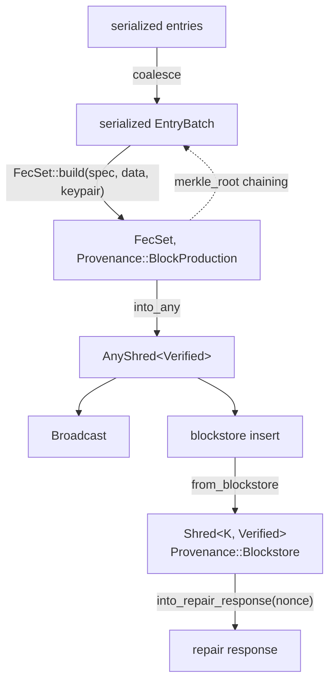

# Egress

Entries broadcast and repair response, which is what
`examples/broadcast_egress.rs` reproduces.

The last batch of a slot reserves room for a retransmitter signature in every shred, so it carries
less data than an interior one.
