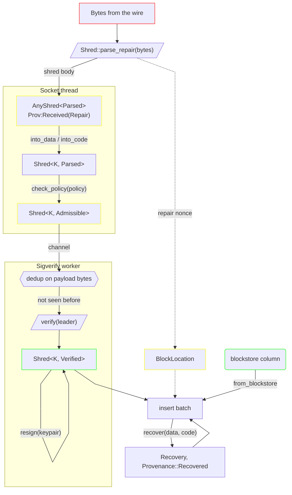

# Ingest

A packet off a socket to a shred in an insert batch, which is
what `examples/ingest_cascade.rs` reproduces.

Policy and signature are two transitions rather than one because the work between them is what
decides whether the signature check happens at all: the batch crosses a channel and duplicates are
dropped first. Deduplication is keyed on the whole payload, so it is sound on unverified bytes.
