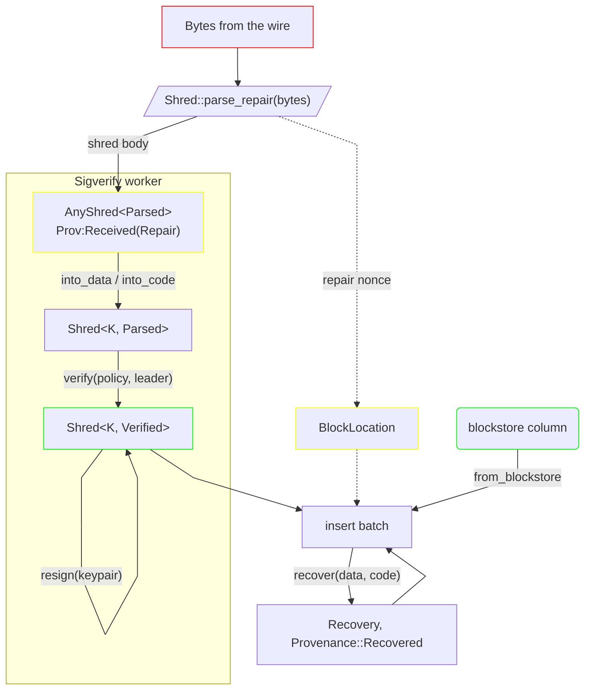

# Ingest

A packet off a socket to a shred in an insert batch, which is 
what `examples/ingest_cascade.rs` reproduces.

```mermaid
---
config:
  flowchart:
    curve: linear
---
flowchart TB
    style packet stroke: #f00
    style parsed stroke: #ff0
    style nonce stroke: #ff0
    style verified stroke: #0f0
    style column stroke: #0f0
    packet["Bytes from the wire"] --> fn_parse[/"Shred::parse_repair(bytes)"/]
    fn_parse -->|"shred body"| parsed["AnyShred&lt;Parsed&gt;<br/>Prov:Received(Repair)"]
    fn_parse -.->|"repair nonce"| nonce["BlockLocation"]
    nonce -.->batch
    subgraph "Sigverify worker"
    parsed -->|"into_data / into_code"| typed["Shred&lt;K, Parsed&gt;"]
    typed -->|"verify(policy, leader)"| verified["Shred&lt;K, Verified&gt;"]
    end
    verified -->|"resign(keypair)"| verified
    verified --> batch["insert batch"]
    column("blockstore column") -->|from_blockstore| batch
    batch -->|"recover(data, code)"| rebuilt["Recovery, Provenance::Recovered"]
    rebuilt --> batch
```
