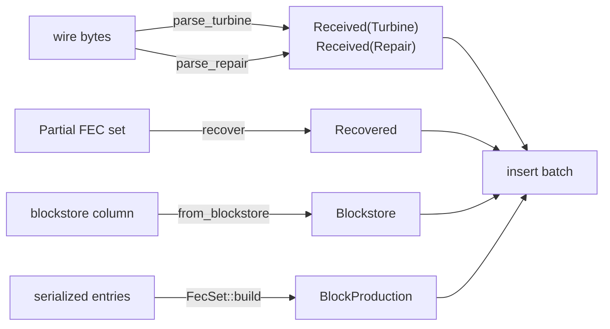

# Provenance

Provenance is a field, not a type parameter. Multiple functions can create a Shred,
each recording where it was made.

Only one operation currently checks provenance, and it is resigning - only received shreds
need to be resigned.
