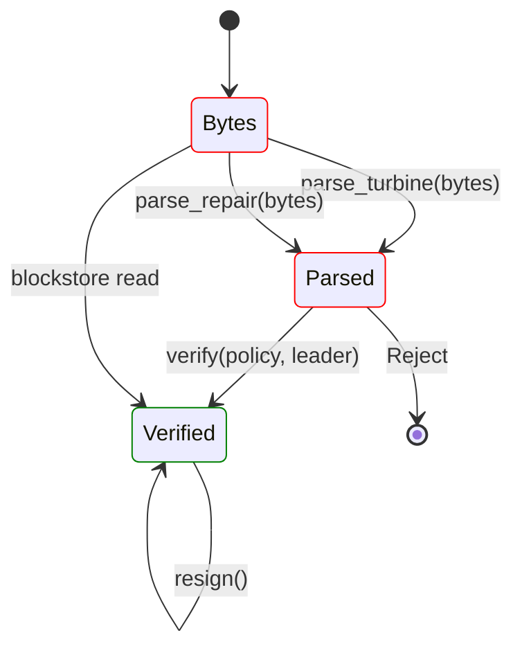

```mermaid
stateDiagram-v2
    classDef Trusted stroke:green;
    classDef Untrusted stroke:red;
    class Verified Trusted
    class Parsed Untrusted
    class Bytes Untrusted 
    [*] --> Bytes
    Bytes --> Parsed : parse_turbine(bytes)
    Bytes --> Parsed : parse_repair(bytes)
    Parsed --> Verified : verify(policy, leader)
    Verified --> Verified : resign()
    Parsed --> [*] : Reject
    Bytes --> Verified :  blockstore read
```
